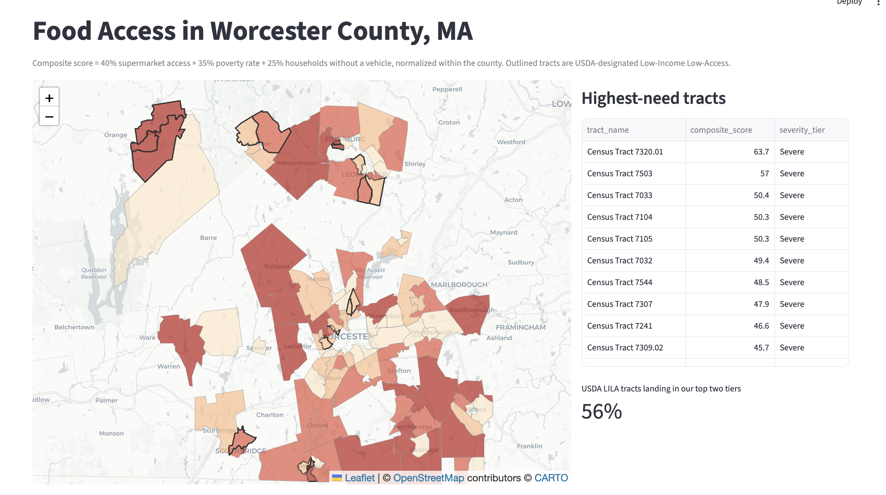
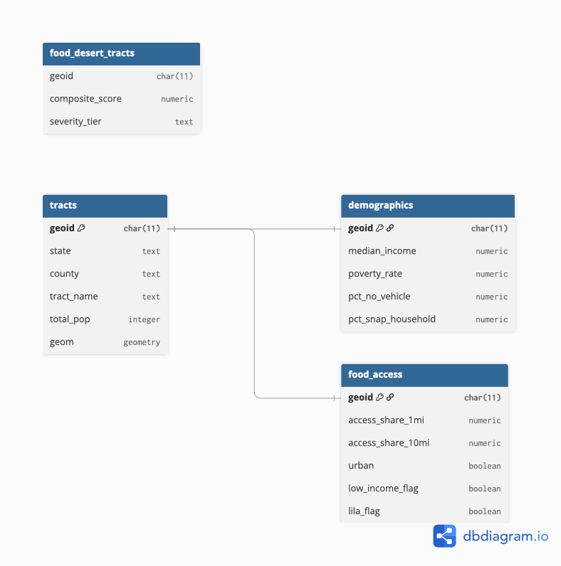

# Food Desert Mapping Pipeline: Worcester County, MA

I built an end-to-end data pipeline that measures food access for every census tract in Worcester County, Massachusetts. My pipeline pulls raw data from three federal sources, loads it into PostgreSQL with PostGIS, computes a transparent food-access score in SQL, and serves the results on an interactive map.



## Why I built this

A food desert is an area where residents have limited access to affordable, healthy food. The USDA publishes an official flag for these areas, but the flag is a yes/no answer. I wanted a score built from logic I could defend, for the county I live in. Worcester County has 172 census tracts and more than 860,000 residents, and I score every one of them.

## Key results

- I scored all 172 census tracts on a 0 to 100 food-access severity scale, covering more than 860,000 residents.
- I found that the highest-need tracts concentrate in inner-city Worcester, with additional clusters in Fitchburg, Leominster, and Southbridge. My top tract scored 63.7, and my entire top ten falls in the Severe tier.
- I benchmarked my results against the USDA's official Low Income Low Access designations: 56 percent of USDA-flagged tracts land in my top two severity tiers. The two methods overlap but diverge on purpose. The USDA flag is binary and distance driven, while my score also weighs poverty and vehicle access, so some USDA-flagged tracts with low poverty rank lower in my tiers.

## Architecture

```
raw data  ->  pandas transform  ->  Postgres/PostGIS  ->  SQL views  ->  Streamlit
```

- **Raw data:** I use the USDA Food Access Research Atlas (Excel), the Census ACS 5-Year (REST API), and TIGER/Line shapefiles, stored untouched in `data/raw`.
- **Pandas transform:** I standardize GEOID join keys as strings, handle missing values and API sentinel codes, and reconcile the same set of tracts across all three sources before anything loads.
- **Postgres/PostGIS:** I load three base tables behind a foreign-key-enforced schema. My loads are idempotent: the pipeline truncates and reloads inside a transaction, so running it twice produces identical results.
- **SQL views:** I compute the composite score and severity tiers in views, not tables. When I change a weight, it is a one-line edit and the results recompute instantly.
- **Streamlit:** I serve an interactive Folium map colored by severity, a ranked table of the highest-need tracts, and my USDA agreement metric.

My database design:



I made the `tracts` table the spine, one row per tract with the PostGIS geometry. The `demographics` table (from the ACS) and the `food_access` table (from the USDA) hang off it with one-to-one foreign keys. I split them by source so I can reload either one without touching the other.

## My composite score

Instead of copying the USDA's yes/no flag, I compute a weighted score:

| Component | Weight | Why I chose it |
|---|---|---|
| Share of population far from a supermarket | 40 percent | Distance defines what a food desert is. I use the USDA's own standards: 1 mile urban, 10 miles rural. |
| Poverty rate | 35 percent | Poverty determines whether nearby food is affordable. |
| Households without a vehicle | 25 percent | A car is a partial workaround for distance, so I weigh it least. |

I min-max normalize each input within the county so no single input dominates because of its scale. I then rank tracts into four severity tiers by quartile: Severe, High, Moderate, and Low.

I load the USDA's official flag only as a benchmark to test against, never as an input, so my score is not circular. My benchmark result: 56 percent of USDA-flagged tracts land in my Severe or High tiers.

I will be honest about the score's limitations. It ignores public transit, so a carless tract on a good bus line looks the same as one with no transit at all. I build the access measure from the USDA's published population shares beyond fixed distances, because exact per-tract distances are not published. And the weights are my judgment call. I chose them for the reasons above and documented them so they can be challenged.

## The vintage decision

I deliberately locked every data source in this project to 2019. The USDA Atlas is built on 2010 census tract boundaries, and the Census Bureau redrew those boundaries in 2020, so joining the 2019 Atlas to any modern ACS release fails silently: no error, just hundreds of tracts that quietly do not match. Aligning the Atlas, the ACS vintage, and the TIGER shapefiles to the same 2010-boundary generation is the most important engineering decision I made in this pipeline, because the failure it prevents is the kind that produces a wrong map instead of an error message.

## Data quality checks

I made the pipeline validate itself on every run:

- I require the same set of GEOIDs to exist in all three sources before anything loads.
- My foreign keys reject any row that references a tract that does not exist.
- After loading, my automated checks confirm the tract count, zero orphan rows, valid geometries, and that every score falls between 0 and 100.

Reproduce it
You need Python 3.10 or newer, PostgreSQL with PostGIS, and a free Census API key from api.census.gov/data/key_signup.html (click the activation link in the email, the key does not work without it).
bash
git clone https://github.com/ReneThee/food-desert-pipeline.git
cd food-desert-pipeline
python3 -m venv .venv
source .venv/bin/activate
pip install -r requirements.txt

createdb fooddesert
psql -d fooddesert -c "CREATE EXTENSION postgis;"
Create a .env file at the project root:
text
CENSUS_API_KEY=your_key_here
DATABASE_URL=postgresql+psycopg2://your_username@localhost:5432/fooddesert
Download the two files the pipeline cannot fetch by API:
The 2019 USDA Food Access Research Atlas Excel file from ers.usda.gov, saved as data/raw/food_access_atlas_2019.xlsx
The TIGER 2019 tract shapefile: curl -o data/raw/tl_2019_25_tract.zip https://www2.census.gov/geo/tiger/TIGER2019/TRACT/tl_2019_25_tract.zip
Then pull the ACS data and build everything:
bash
python src/extract_acs.py
python run_pipeline.py
streamlit run app/streamlit_app.py
The map opens at localhost:8501. I tested these steps end to end in a fresh clone.
Project structure
food-desert-pipeline/
    run_pipeline.py       one-command rebuild with quality checks
    requirements.txt
    src/
        extract_acs.py    pulls ACS data from the Census API
        etl.py            transforms and loads all three sources
        check_geoids.py   three-way GEOID reconciliation
    sql/
        schema.sql        tables with foreign key integrity
        views.sql         composite score and severity tiers
    app/
        streamlit_app.py  interactive severity map
    docs/
        erd.png           schema diagram
        map.png           map screenshot

## What I would build next

I would add transit route data to refine the access measure, automate the two manual downloads, and schedule the rebuild so my results stay current when new Atlas releases arrive.
